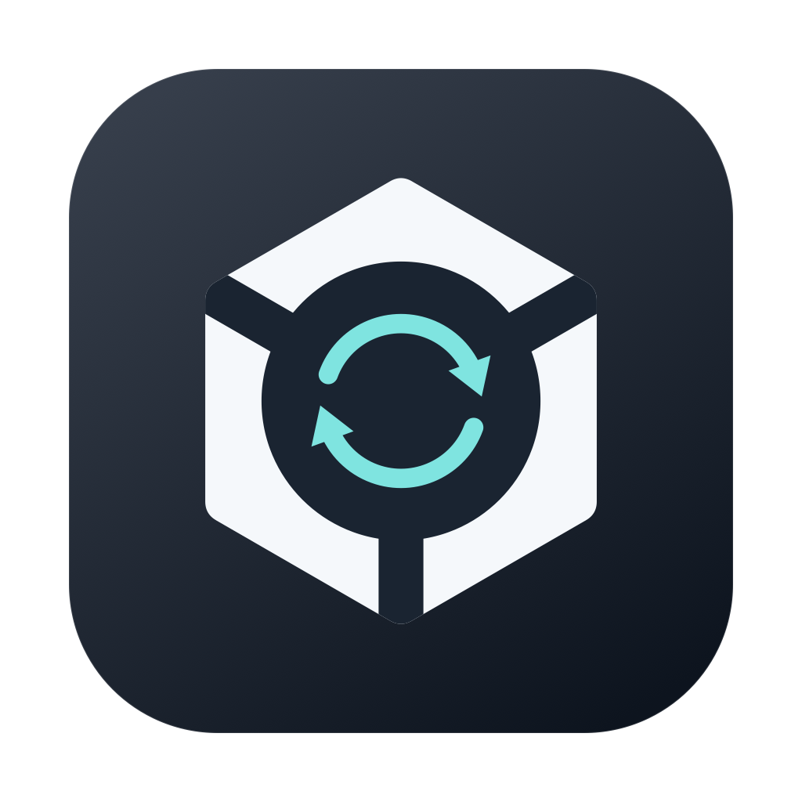

# Rekordbox Setup Cloner

[](https://github.com/HerzogVonWiesel/rekordbox-setup-cloner/actions/workflows/macos.yml)

<p align="center"></p>

Take your rekordbox preferences to another computer, then restore the host's setup afterwards. Native apps for **macOS and Windows**, with portable `.rbsetup` backups and automatic local restore points. No network services required.

## Download

Get the ZIP for your platform from [**Releases**](https://github.com/HerzogVonWiesel/rekordbox-setup-cloner/releases):

| Platform | Download | Installation |
| --- | --- | --- |
| macOS 13+ · Apple Silicon & Intel | `…-macos-universal.zip` | Extract and move **Rekordbox Setup Cloner.app** to Applications. |
| Windows 10/11 · x64 | `…-windows-x64.zip` | Extract and run **RekordboxSetupCloner.exe**. No installer or .NET installation needed. |

On macOS, you may need **System Settings → Privacy & Security → Open Anyway** because the app is not notarized. Releases include SHA-256 checksums for both downloads.

## Quick start

1. Set up your preferences in rekordbox, then **quit rekordbox**.
2. Open the cloner, **Inspect** your settings folder, and select the groups to transfer.
3. Name your setup and choose **Save setup…**. Take the `.rbsetup` file to the other computer.
4. On the destination, open and quit rekordbox at least once. Open the cloner, select the settings folder and groups, then choose **Open backup & preview…**.
5. Review the changes and choose **Save restore point & import**. Afterwards, you can open rekordbox.
6. To undo the import, quit rekordbox and choose **Restore previous setup…**, selecting the restore point from before the import.

Different rekordbox versions can exchange matching settings. Version differences appear as a notice in the preview; missing preferences and incompatible layouts or XML file formats are skipped. MIDI mappings remain controller-specific.

## What transfers

Choose any combination of:

- **STEMS & waveforms:** activation, processing quality, part layout, colours, zoom and display options.
- **Screen layout & deck/mixer:** panels, browser columns, fonts, quantize, cue/load behaviour, tempo ranges and fader preferences.
- **Sampler, sequencer & Groove Circuit:** layout, banks, sync, quantize, capture behaviour and FX controls.
- **Pad FX, effects & mappings:** effect banks, Merge FX, keyboard shortcuts, MIDI mappings and custom pad layouts.
- **Analysis & recording:** analysis options, recording triggers, track splitting and normalization.
- **Controller, video & lighting:** jog displays, LEDs, slip indicators, overlays and lighting behaviour.

Music, playlists, library/analysis data, accounts, licenses, audio routing, sample assignments and machine-specific paths stay local. Portable backups contain selected preferences, not a copy of the main settings file.

### Copy Pad FX between decks

Quit rekordbox, choose **Deck 1 → Deck 2** or **Deck 2 → Deck 1**, and select **Pad FX 1**, **Pad FX 2**, or **Both banks**. Choose **Preview copy…**, then **Save restore point & copy**. The source deck, other decks and unselected banks are preserved.

## Settings & restore points

| Platform | Default rekordbox settings folder |
| --- | --- |
| macOS | `~/Library/Application Support/Pioneer/rekordbox6` (also used by rekordbox 7) |
| Windows | `%APPDATA%\Pioneer\rekordbox6`, falling back to `rekordbox` when it contains the settings file |

You can choose another folder in the app. Version detection is optional and requires no manual selection. Before an import, Pad FX copy or restore, the original affected files are saved locally:

- **macOS:** `~/Library/Application Support/Rekordbox Setup Cloner/Restore Points/`
- **Windows:** `%LOCALAPPDATA%\Rekordbox Setup Cloner\Restore Points\`

Restore points belong to their original settings folder and replace whole files, including later edits. They have private file permissions but are not encrypted and may contain account credentials. Share **`.rbsetup` files only**, not `.rbrecovery` restore points.

## Build from source

**macOS** — requires Xcode or the Xcode command-line tools:

```sh
bash scripts/package-release.sh
```

**Windows** — requires the .NET 10 SDK and Visual Studio Build Tools with **Desktop development with C++** (including the Windows SDK); run in PowerShell. Native AOT produces a standalone executable with no .NET runtime installation or bundle:

```powershell
powershell -ExecutionPolicy Bypass -File scripts/package-windows-release.ps1
```

Release ZIPs and checksums are written to `dist/release/`. GitHub Actions also builds both platforms on pushes to `main`, pull requests and manual runs.

To publish a release, update the version/build number in `Resources/Info.plist`, commit, and push a matching `vX.Y.Z` tag. The workflow publishes both platform ZIPs and their checksums to GitHub Releases.
